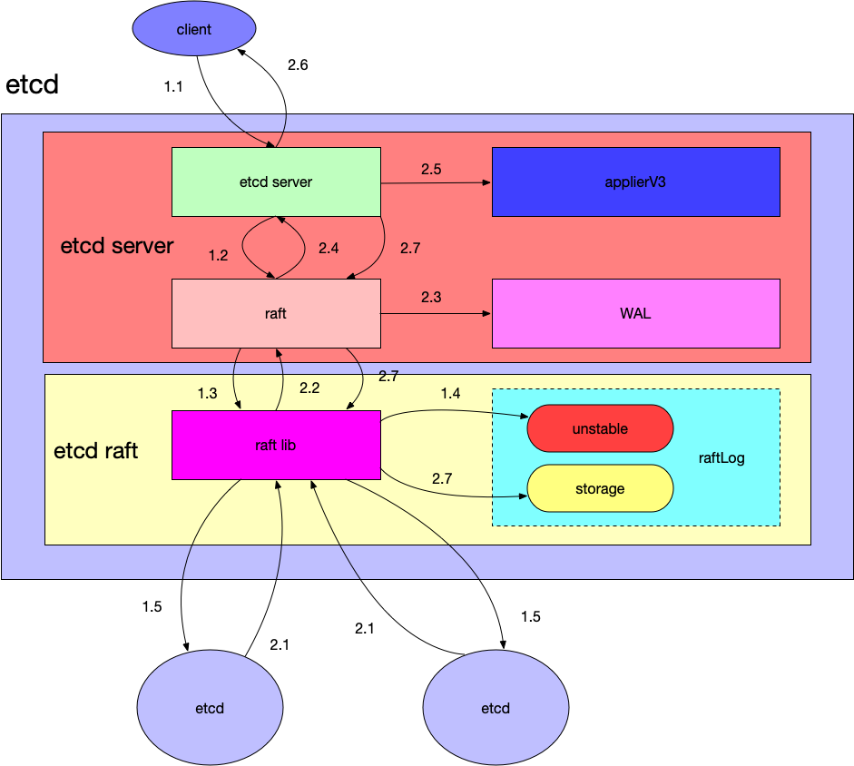
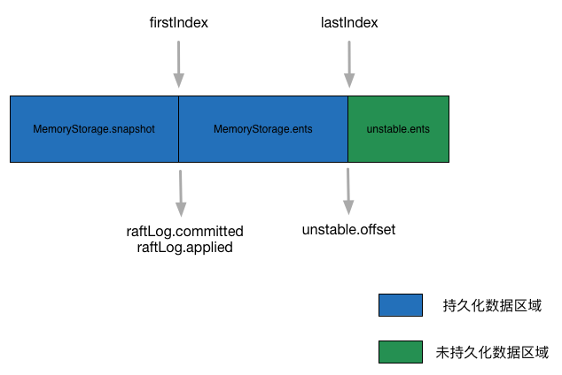

# 概览



​										                        摘自[codedump](https://www.codedump.info/post/20181125-etcd-server/)

1.1	serverClient中handler处理客户端请求(processInternalRaftRequestOnce)

1.2	raftNode.Propose 写入proposeC,注册wait等待结果

1.3	proposeC 读取消息进入stepLeader

1.4 raftLog.append写入unstable

1.5 bcastAppend广播给其他节点（readyC通知etcdserver, 再通过tansport发送）

2.1	serverPeers中handler收到其他节点回应, raftNode.Propose 写入recvC

2.2 收到超过半数节点的回应，通过readyC通知raftNot可以提交

2.3	r.storage.Save先写入wal模块

2.4	applyc写入appy消息，

2.5	applyAll中写入持久化存储

2.6	applyEntryNormal中s.w.Trigger触发回复客户端


# raft模块

### 概览（node.run）

不断接收外部消息（recvC, proposeC, confC），进入step函数根据当前角色处理对应消息

需要上层处理的消息追加到msgs字段，等待时机封装到Ready实例通知上层

通过advancec保证当前只有一个ready实例在处理中


#### 写操作处理流程

先append到unstable.ents，广播通知其他节点

计算prs.Match（递增排序，前一半分界点即为大多数节点已复制的index）作为commitIdx

ready实例封装commitIdx、unstable.ents、committedEnts给上层进行持久化

advance中再根据ready实例中的数据更新appliedIdx等数据

### node 结构

```
type node struct {
	propc      chan msgWithResult   // 本地客户端消息
	recvc      chan pb.Message	// peer节点消息
	confc      chan pb.ConfChangeV2	// 配置变更消息
	confstatec chan pb.ConfState	// 
	readyc     chan Ready	// 通知上层
	advancec   chan struct{} // 上层已处理完一个ready实例
	tickc      chan struct{} // 上层调用推进逻辑时钟
```

实现Node接口，供上层模块调用

### raftlog 结构




firstIndex、lastIndex针对所有ents(包括storage和unstable)

unstable中snapshot只有follower从leader接受快照时才存在，snapshot和ents不会共存